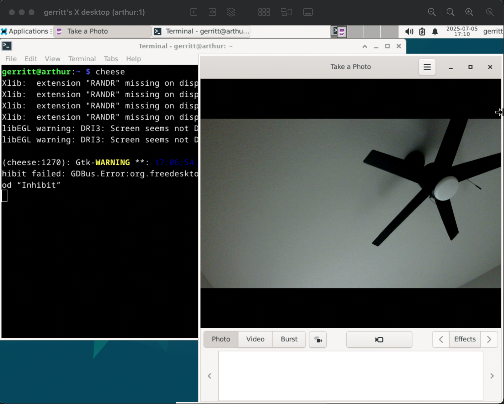

# realtime-embedded-assignment-4
Repository for the fourth assignment of CU Boulder's Real Time Embedded Systems course

## Problem 1

>  Obtain a Logitech C270 camera (or equivalent) and verify that is detected by the Raspberry Pi USB driver.

> A: Show that it has been detected by using lsusb, lsmod and dmesg kernel driver configuration tool to make sure your Logitech C270 USB camera is plugged in and recognized. Do lsusb | grep -i logitech and prove to me (and more importantly yourself) with that output (screenshot) that your camera is recognized.

```bash
$ lsusb | grep -i logitech
// Confirmed my webcam make and model is correct
Bus 001 Device 003: ID 046d:0825 Logitech, Inc. Webcam C270
```

> B: Now, do lsmod | grep video and verify that the UVC driver is loaded as well (http://www.ideasonboard.org/uvc/).

```bash
$ lsmod | grep video
// Confirmed UVC video has been loaded
uvcvideo              110592  0
uvc                    12288  1 uvcvideo
videobuf2_vmalloc      12288  2 uvcvideo,bcm2835_v4l2
videobuf2_dma_contig    20480  3 bcm2835_codec,rpi_hevc_dec,bcm2835_isp
videobuf2_memops       12288  2 videobuf2_vmalloc,videobuf2_dma_contig
videobuf2_v4l2         32768  6 bcm2835_codec,rpi_hevc_dec,uvcvideo,bcm2835_v4l2,v4l2_mem2mem,bcm2835_isp
videodev              311296  7 bcm2835_codec,rpi_hevc_dec,videobuf2_v4l2,uvcvideo,bcm2835_v4l2,v4l2_mem2mem,bcm2835_isp
videobuf2_common       73728  10 bcm2835_codec,videobuf2_vmalloc,rpi_hevc_dec,videobuf2_dma_contig,videobuf2_v4l2,uvcvideo,bcm2835_v4l2,v4l2_mem2mem,videobuf2_memops,bcm2835_isp
mc                     61440  9 videodev,bcm2835_codec,snd_usb_audio,rpi_hevc_dec,videobuf2_v4l2,uvcvideo,videobuf2_common,v4l2_mem2mem,bcm2835_isp
```

> C: To further verify, or debug if you don’t see the UVC driver loaded in response to plugging in the USB camera, do dmesg | grep video or just dmesg and scroll through the log messages to see if your USB device was found.

```bash
$ dmesg
...
// Plugged in for the first time
[2353489.790568] usb 1-1.1: new high-speed USB device number 3 using xhci_hcd
[2353490.091891] usb 1-1.1: New USB device found, idVendor=046d, idProduct=0825, bcdDevice= 6.07
[2353490.091917] usb 1-1.1: New USB device strings: Mfr=0, Product=2, SerialNumber=1
[2353490.091931] usb 1-1.1: Product: C270 HD WEBCAM
[2353490.091942] usb 1-1.1: SerialNumber: A1219F40
[2353490.200605] usb 1-1.1: Found UVC 1.00 device C270 HD WEBCAM (046d:0825)
[2353490.325407] usbcore: registered new interface driver uvcvideo
[2353490.400438] usb 1-1.1: set resolution quirk: cval->res = 384
[2353490.400716] usbcore: registered new interface driver snd-usb-audio
// Disconnected the camera
[2353691.497092] usb 1-1.1: USB disconnect, device number 3
// Plugged back in
[2353699.120537] usb 1-1.1: new high-speed USB device number 4 using xhci_hcd
[2353699.421908] usb 1-1.1: New USB device found, idVendor=046d, idProduct=0825, bcdDevice= 6.07
[2353699.421935] usb 1-1.1: New USB device strings: Mfr=0, Product=2, SerialNumber=1
[2353699.421949] usb 1-1.1: Product: C270 HD WEBCAM
[2353699.421960] usb 1-1.1: SerialNumber: A1219F40
[2353699.423685] usb 1-1.1: Found UVC 1.00 device C270 HD WEBCAM (046d:0825)
[2353699.725742] usb 1-1.1: set resolution quirk: cval->res = 384
```

> D: Capture all output and annotate what you see with descriptions to the best of your understanding.

All output has been captured in parts A-C.  The webcam connection is confirmed, the UVC drivers have been loaded, and the system logs corroborate that the device is connected with the drivers loaded.

## Problem 2

> If you do not have cheese or camorama, do “sudo apt-get install cheese” on your Raspberry Pi board [you may need to first do sudo apt-get update]. Camorama is supported on Ubuntu, but may not be on the R-Pi, so use cheese instead on the R-Pi. If for  some reason cheese does not work for you, use an alternative application (e.g., install with “sudo apt-get install camorama” or one of these - https://www.makeuseof.com/best-cameraapps-linux/). This should not only install nice camera capture GUI tools, but also the V4L2 API (described well in this series of Linux articles - http://lwn.net/Articles/203924/). Provide a summary log of your installation

I am first starting with trying to install `cheese` by using `sudo apt-get install cheese`.  This will be a fairly large installation because cheese requires many GUI packages and I originally installed the headless version of Raspberry Pi OS on my dev board.  The install will be ~850MB which is very large compared to what I was originally expected.  The installation took about 3 minutes.  Since I am still running headless, I will need to exit the current SSH session and restart the session with the `-X` flag to enable X-11 forwarding.  I might need to enable some other settings within the pi as well.

After installing XQuartz on my laptop and trying some other workarounds, I am still unable to run cheese.  I am getting segfault errors when cheese tries to start up.  I am now going to try installing camorama with `sudo apt-get install camorama`.

`camorama` was unable to be installed via `apt` or `apt-get` potentially due to obselescence.

I moved over to using a vnc server so I can get a full desktop experience remotely.  I ran `sudo apt install xfce4 xfce4-goodies tightvncserver` to install the dependencies.  I then ran `echo "startxfce4" > ~/.xsession` and `chmod +x ~/.xsession`.  To run the vnc server I needed to run `vncserver :1` on my SSH session and wait for it to return.  Then from my macbook, I was able to open a finder window, hit `Cmd + K`, enter `vnc://<my raspberry pi ip>:5901`, and then log into the vnc session.  I now have a graphical interface.

> A: Run camorama with no arguments and it should provide an interactive camera control session for your Logitech C2xx camera – provide a screen dump of the GUI.



> B: If you have issues connecting to your camera do a “man camorama” and specify your camera device file entry point (e.g. /dev/video0). Run camorama and play with Hue, Color, Brightness, White Balance and Contrast, take an example image, and take a screen shot of the tool and provide both in your report. If you need to resolve issues with your network, USB, or sudo and your account, research this and please do so.

Cheese appears to only have full screen effects like mirroring the image, distorting the image, etc.  It doesn't have any hue or brightness alteration.  I have resolved network, USB, and interface issues.

## Problem 3

> Using your verified Logitech C270 camera on your Raspberry Pi, now verify that it can stream continuously.

> A: Using starter code, capture a raw image buffer for transformation and processing using example code such as simple-capture. This basic example interfaces to the UVC and USB kernel driver modules through the V4L2 API. Provide a screen shot to prove that you got continuous capture to work with V4L2. To display images you have captured, you will find “eom” to be quite useful, which can be installed with “sudo apt-get install eom”.

Below is the output from running the starter code in `simple-capture`:

```bash
$ sudo ./capture
FORCING FORMAT
allocated buffer 0
allocated buffer 1
allocated buffer 2
allocated buffer 3
allocated buffer 4
allocated buffer 5
frame 1: Dump YUYV converted to RGB size 153600
wrote 230400 bytes
time_error.tv_sec=0, time_error.tv_nsec=0
frame 2: Dump YUYV converted to RGB size 153600
wrote 230400 bytes
time_error.tv_sec=0, time_error.tv_nsec=0
frame 3: Dump YUYV converted to RGB size 153600
wrote 230400 bytes
time_error.tv_sec=0, time_error.tv_nsec=0
frame 4: Dump YUYV converted to RGB size 153600
wrote 230400 bytes
time_error.tv_sec=0, time_error.tv_nsec=0
frame 5: Dump YUYV converted to RGB size 153600
wrote 230400 bytes
time_error.tv_sec=0, time_error.tv_nsec=0
frame 6: Dump YUYV converted to RGB size 153600
wrote 230400 bytes
time_error.tv_sec=0, time_error.tv_nsec=0
frame 7: Dump YUYV converted to RGB size 153600
wrote 230400 bytes
time_error.tv_sec=0, time_error.tv_nsec=0
frame 8: Dump YUYV converted to RGB size 153600
wrote 230400 bytes
time_error.tv_sec=0, time_error.tv_nsec=0
frame 9: Dump YUYV converted to RGB size 153600
wrote 230400 bytes
time_error.tv_sec=0, time_error.tv_nsec=0
frame 10: Dump YUYV converted to RGB size 153600
wrote 230400 bytes
time_error.tv_sec=0, time_error.tv_nsec=0
frame 11: Dump YUYV converted to RGB size 153600
wrote 230400 bytes
time_error.tv_sec=0, time_error.tv_nsec=0
frame 12: Dump YUYV converted to RGB size 153600
wrote 230400 bytes
time_error.tv_sec=0, time_error.tv_nsec=0
frame 13: Dump YUYV converted to RGB size 153600
wrote 230400 bytes
time_error.tv_sec=0, time_error.tv_nsec=0
frame 14: Dump YUYV converted to RGB size 153600
wrote 230400 bytes
time_error.tv_sec=0, time_error.tv_nsec=0
frame 15: Dump YUYV converted to RGB size 153600
wrote 230400 bytes
time_error.tv_sec=0, time_error.tv_nsec=0
frame 16: Dump YUYV converted to RGB size 153600
wrote 230400 bytes
time_error.tv_sec=0, time_error.tv_nsec=0
frame 17: Dump YUYV converted to RGB size 153600
wrote 230400 bytes
time_error.tv_sec=0, time_error.tv_nsec=0
frame 18: Dump YUYV converted to RGB size 153600
wrote 230400 bytes
time_error.tv_sec=0, time_error.tv_nsec=0
frame 19: Dump YUYV converted to RGB size 153600
wrote 230400 bytes
time_error.tv_sec=0, time_error.tv_nsec=0
frame 20: Dump YUYV converted to RGB size 153600
wrote 230400 bytes
time_error.tv_sec=0, time_error.tv_nsec=0
frame 21: Dump YUYV converted to RGB size 153600
wrote 230400 bytes
time_error.tv_sec=0, time_error.tv_nsec=0
frame 22: Dump YUYV converted to RGB size 153600
wrote 230400 bytes
time_error.tv_sec=0, time_error.tv_nsec=0
frame 23: Dump YUYV converted to RGB size 153600
wrote 230400 bytes
time_error.tv_sec=0, time_error.tv_nsec=0
frame 24: Dump YUYV converted to RGB size 153600
wrote 230400 bytes
time_error.tv_sec=0, time_error.tv_nsec=0
frame 25: Dump YUYV converted to RGB size 153600
wrote 230400 bytes
time_error.tv_sec=0, time_error.tv_nsec=0
frame 26: Dump YUYV converted to RGB size 153600
wrote 230400 bytes
time_error.tv_sec=0, time_error.tv_nsec=0
frame 27: Dump YUYV converted to RGB size 153600
wrote 230400 bytes
time_error.tv_sec=0, time_error.tv_nsec=0
frame 28: Dump YUYV converted to RGB size 153600
wrote 230400 bytes
time_error.tv_sec=0, time_error.tv_nsec=0
frame 29: Dump YUYV converted to RGB size 153600
wrote 230400 bytes
time_error.tv_sec=0, time_error.tv_nsec=0
frame 30: Dump YUYV converted to RGB size 153600
wrote 230400 bytes
time_error.tv_sec=0, time_error.tv_nsec=0
```

When logging into my VNC session and using `eom` to look through the images, I am noticing that the first ~15 images taken by the camera are fully black and after that all of the remaining images are valid captures of my office.  I am wondering if it is because the camera takes time to go from idle to capturing and the program is going too fast for the camera to keep up.

I tried adding a thread sleep after initializing the camera/starting the capture and I am still not seeing an improvement.  There might be a few less black images but there are still a few that are completely devoid of data at the start of the capture.

> B: Download starter code (simple-capture-1800) that captures 1800 frames from your camera using V4L2 and run it as is first to test the code (use “make clean”, “make”, and run – note that make clean will remove test frames). Modify the code so that it uses syslog rather than printf to the console for tracing. Then, compare frame rate for PGM (graymap) and PPM (color) image write-back to the frame sub-directory on your flash filesystem and provide analysis of average and worst-case (lowest) frame rate seen for each.

After running the code, I am seeing that the program differs slightly from the expected behavior as laid out by the question.  This program by default only captures 182 frames as opposed to 1800 frames outlined in the problem statement.  It has the same output as the `simple-capture` program as well.  The program will take a total of 189 captures but the first 7 are always discarded based off the code.  I am wondering if this is because of the issue that I noted in part A of this problem.  The images are captured at a frequency of 1Hz.

After updating the program to use `syslog` instead of `printf`, I also added in timing functionality to the `read_frame()` function.  This function handles **reading** the next frame from the camera, processing it, and writing it to a file which is the complete cycle taken for each frame.  I have captured the logs running with `COLOR_CONVERT_RBG` both defined and undefined and captured them to `ppm-output.log` and `pgm-output.log` respectively.

I have written a python script, `analyze_logs.py`, and have placed it in the `simple-capture-1800` directory.  First, to analyze the default behavior of the program with it outputting the images to grayscale, you can run `python3 analyze_logs.py` and when prompted, input `pgm-output.log`.  This will produce the following output:

```text
--- Analysis Results for: pgm-output.log ---
Mean read_frame time: 0.008402 seconds
Min read_frame time: 0.007256 seconds
Median read_frame time: 0.008393 seconds
Max read_frame time: 0.011143 seconds
------------------------------------------
Mean read_frame FPS: 119.021305 fps
Min read_frame FPS: 137.816979 fps
Median read_frame fps: 119.139811 fps
Max read_frame fps: 89.742439 fps
------------------------------------------
```

Ass seen here, the average time for reading, altering, and storing an image is 0.0084 seconds which translates to ~119.02 frames per second.  Meanwhile, the worst case read time for a frame was 0.0111 seconds which translates to ~89.74 frames per second which is nearly a 30 frame per second drop from the average.  In a soft real time environment this might be acceptable but for hard real time if the period was 0.01, the deadline would have been missed causing potentially catastrophic results.

Next, when analyzing `ppm-output.log` in the same way, the results produced the following:

```
--- Analysis Results for: ppm-output.log ---
Mean read_frame time: 0.034039 seconds
Min read_frame time: 0.029290 seconds
Median read_frame time: 0.034055 seconds
Max read_frame time: 0.036320 seconds
------------------------------------------
Mean read_frame FPS: 29.378185 fps
Min read_frame FPS: 34.141345 fps
Median read_frame fps: 29.364264 fps
Max read_frame fps: 27.533040 fps
------------------------------------------
```

It can be seen that when converting to RGB it takes much longer than just going to gray scale.  This is most likely due to the amount of data being written to disk and the additional processing needed for each pixel.  The average frame time was 0.03404 seconds, or 29.378 frames per second, with a worst case frame time of 0.3632 seconds, or 27.53 frames per second.  It seems like a T of 0.05 seconds, or 20 frames per second, could be a good candidate.

## Problem 4

> Choose ONE continuous transformation for each acquired frame such as color conversion (Lecture-Cont-Media.pdf, slide 5), conversion to grayscale (slide 6), negative image (new_pixel = saturation – pixel), brightness/contrast adjustment (e.g., /cbrighten/brighten.c), or sharpening (/sharpen-psf/sharpen.c) and consider how to apply this to a real-time stream of image frames acquired from your camera rather than just one image file (PPM in the examples).

I have chosen to use the provided `sharpen` example to test sharpening images as a part of real time processing.

> A: Show a screen shot to prove you built and ran the code and a before and after transform example image.

I have updated the makefile so that it will build the `sharpen.c` file.  This file takes in two inputs.  One to provide the path to an input image which has to be `400x300` exactly and in the .ppm format and one to provide the path to where the resulting transformed image should be output which must also be a .ppm format.

I will be using the provided starter image, `Cactus-120kpixel.ppm`, to test sharpening an image and timing it.  The starting image is:


Then, after building and running `sudo ./sharpen Cactus-120kpixel.ppm Cactus-120kpixel-sharpened.ppm` I get the resulting image:


The original image appears to have been a little blurry and after the transformation was performed, the image now appears with more distinct edges on the edges of objects in the image.  It also appears a bit more distinct when transitioning from object to object making like colors more similar and different colors more distinct.

> B: Provide a detailed explanation of your code and research uses for the continuous transformations and describe how this might be used in a machine vision application.

The way that this code works is as follows:

1. The initial `.ppm` image and the output `.ppm` image are both opened with the input image being opened with the Read Only flag and the output image being opened with the Read/Write and Create flags meaning a new file will be created when the program is ran.
2. The header of the input image is parsed which is 21 bytes long.
3. The input image is then loaded into three individaul buffers, `R[], G[], B[]` which are the 3 color channels.  Each of these buffers is 120,000 bytes long since the expected input image is 400x300.  The color channels are also loaded into `convR[], convG[], convB[]` which are the same size.
4. The program then loops through each pixel in the image other than the first and last pixel of each row and column and convolves the each RGB value of the pixel with the RGB value of all of the surrounding pixels multiplied by a Point Spread Function.
5. After looping through each of the pixels and storing the convolved values in `convR[], convB[], convB[]`, it writes the original header into the output file and then outputs the RGB sets back into the image.

Potential uses for an image sharpening algorithm in a machine vision application:
1. Sharpening an image enhances the distinct features within an image.  This makes it easier for other algorithms to distinguish objects from the background or other objects.  This will also improve the accuracy of object detection if it is easier.
2. A sharpened image is easier to extract features of an image.  This will improve both training and run time performance of tasks like image classification or segmentation.
3. Sharpening will also help with reducing blur.  If the camera is blurry for any reason, sharpening can help un-blur the image a bit to improve the image quality.

> C: What was the best frame rate for continuous transform processing for the transform you chose to investigate?

TODO:

> Note that your real bottleneck may be writing your frames to your flash file system device, so try disabling frame write-back to the frame sub-directory and transforming frames, but not saving them.

## Problem 5

> Using a Logitech C270 (or equivalent), choose ONE real-time frame transformation and measure the frame processing time (WCET). I have made some videos on the “L-N9.#-Final-Project” (found in Lightboard-Studio-rough-cuts) that demonstrate the analysis of a single thread design (simple-capture-1800) and use of syslog for tracing (CW21-C4-simplecapture-1800-starter-code-for-project) and you may also find simple-capture1800-syslog/ useful.

TODO:

> A: Please implement and compare transform performance in terms of average transform processing time and overall average frame rate for acquisition, transformation and writeback of only the transformed frame. Note the average for each step clearly (acquisition, processing, write-back).

TODO:

> B: Please implement and compare transform performance in terms of average frame rate for transformation and write-back of both the transformed frame and captured.

TODO:

> C: Based on average analysis for transform frame only write-back, pick a reasonable soft real-time deadline (e.g., if average frame rate is 10 Hz, choose a deadline of 100 milliseconds) and convert the processing to SCHED_FIFO and determine if you can meet deadlines with predictability. Note, here are some examples of monotonic service analysis and jitter (here). The drift is shown as a red polynomial trend line and jitter is a plot of raw delta-t data compared to expected.